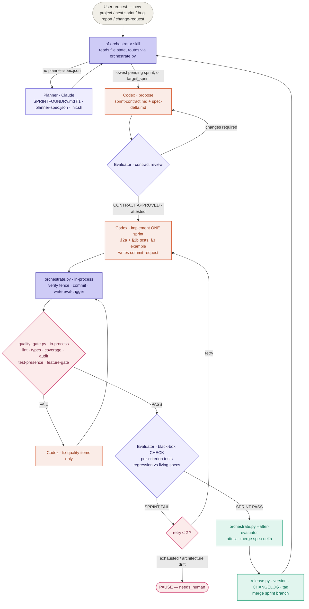

[中文](./README.zh-CN.md) | **English**

# SprintFoundry

SprintFoundry is a Claude Code plugin for AI-driven software delivery. It packages a three-agent sprint harness where Claude plans, routes, and independently evaluates work, while Codex CLI performs the actual implementation.

Current release: [v3.0.0](https://github.com/YuSec2021/sprintfoundry/releases/tag/v3.0.0) · [Download `sprintfoundry.plugin`](https://github.com/YuSec2021/sprintfoundry/releases/download/v3.0.0/sprintfoundry.plugin)

This repository is now primarily a plugin source and release repository. The canonical runtime entrypoint is the plugin skill:

```text
sf-orchestrator
```

The older root-level harness files and scripts remain as development references, tests, and compatibility scaffolding, but published users should consume the complete plugin under `plugins/sprintfoundry`.

## Plugin Architecture

```text
plugins/sprintfoundry/
├── .claude-plugin/
│   └── plugin.json
├── agents/
│   ├── evaluator.md
│   ├── generator.md
│   └── planner.md
└── skills/
    ├── sf-orchestrator/
    │   ├── SKILL.md
    │   ├── scripts/
    │   │   ├── orchestrate.py
    │   │   ├── quality_gate.py
    │   │   └── release.py
    │   └── references/
    │       ├── evaluator-agent.md
    │       ├── generator-rules.md
    │       ├── planner-agent.md
    │       ├── protocol.md
    │       ├── quality-gate.md
    │       └── version-updates.md
    ├── branching/
    │   └── SKILL.md
    └── observability/
        ├── SKILL.md
        └── references/
```

Marketplace metadata lives at:

- `.claude-plugin/marketplace.json`
- `plugins/sprintfoundry/.claude-plugin/plugin.json`

The plugin contains:

| Component | Purpose |
| --- | --- |
| `sf-orchestrator` skill | Main user-facing coordinator and routing engine |
| `planner` agent | Expands a short request into `planner-spec.json`, `init.sh`, and sprint plan |
| `generator` agent doc | Mirrors the Codex Generator contract for human review; actual implementation runs through Codex CLI |
| `evaluator` agent | Reviews sprint contracts and performs independent black-box verification |
| `branching` skill | One-branch-per-sprint workflow and active branch recovery |
| `observability` skill | Run state, event logs, pause/escalation summaries, and context hygiene |

## v3 Execution Architecture

Version 3 moves deterministic work behind the script boundary so the model is used only where judgment is required. `orchestrate.py` now chains validated commit requests, quality-gate execution and attestation, post-Evaluator routing, spec-delta merging, and release handoff in-process. `quality_gate.py` owns static quality checks, while `release.py` owns version artifacts, release commits and tags, and sprint-branch merging.

The combined entry points `--snapshot`, `--after-contract-review`, and `--after-evaluator` replace repeated state-reading and attestation round trips. On the measured happy path, a complete sprint now needs 4 Orchestrator calls instead of 11. `sf-orchestrator/SKILL.md` was reduced from 1019 to 245 lines (about 11.8k to 2.9k tokens) by removing embedded executable code, without weakening contract approval, quality, black-box CHECK, attestation, or fence gates.

## Runtime Model

SprintFoundry uses a strict separation of responsibility:

| Role | Runtime | Responsibility |
| --- | --- | --- |
| Planner | Claude sub-agent | Classifies scope, then turns a request into product direction, verification mode, and sprint plan |
| Generator | Codex CLI | Implements one approved sprint, self-checks, and writes a commit request |
| Evaluator | Claude sub-agent + verification tools | Reviews contracts and verifies committed work through the configured external surface |
| Orchestrator | `sf-orchestrator` skill + local scripts | Reads file state, invokes agents for judgment, resolves mechanical actions in-process, owns Git commits and `.sprintfoundry/signals/eval-trigger.txt`, and pauses on unsafe state |

Important boundaries:

- Claude does not write application code.
- Codex does not evaluate its own output or write Git metadata.
- `.sprintfoundry/signals/eval-trigger.txt` is written only after the Orchestrator has committed the sprint.
- Progress advances through file artifacts, not chat memory.
- Codex runs in a workspace-write sandbox by default; package caches stay under `.sprintfoundry/cache/`.
- A sprint is complete only when its eval result has a dedicated `SPRINT PASS` verdict line and a valid Orchestrator attestation.
- `SPRINTFOUNDRY.md` is the project constitution for architecture, testing, and examples; it outranks per-sprint decisions on those dimensions.

## Main Flow

Blue is Claude, orange is Codex, purple is the Orchestrator, red is a blocking gate, green is a completed sprint.


```mermaid
flowchart TD
    U(["User request — new project / next sprint / bug-report / change-request"]) --> O

    O["sf-orchestrator skill<br/>reads file state, routes via orchestrate.py"]

    O -->|no planner-spec.json| PL["Planner · Claude<br/>SPRINTFOUNDRY.md §1 · planner-spec.json · init.sh"]
    PL --> O

    O -->|lowest pending sprint, or target_sprint| PC["Codex · propose<br/>sprint-contract.md + spec-delta.md"]
    PC --> CR{"Evaluator · contract review"}
    CR -->|changes required| PC
    CR -->|CONTRACT APPROVED · attested| IM

    IM["Codex · implement ONE sprint<br/>§2a + §2b tests, §3 example<br/>writes commit-request"]
    IM --> CM["orchestrate.py · in-process<br/>verify fence · commit · write eval-trigger"]
    CM --> QG{"quality_gate.py · in-process<br/>lint · types · coverage · audit<br/>test-presence · feature-gate"}
    QG -->|FAIL| QR["Codex · fix quality items only"]
    QR --> CM
    QG -->|PASS| EV{"Evaluator · black-box CHECK<br/>per-criterion tests<br/>regression vs living specs"}

    EV -->|SPRINT FAIL| RT{"retry ≤ 2 ?"}
    RT -->|retry| IM
    RT -->|exhausted / architecture drift| HP(["PAUSE — needs_human"])

    EV -->|SPRINT PASS| MG["orchestrate.py --after-evaluator<br/>attest · merge spec-delta"]
    MG --> VB["release.py · version · CHANGELOG · tag<br/>merge sprint branch"]
    VB --> O

    classDef claude fill:#EEEDFE,stroke:#7F77DD,stroke-width:1.5px,color:#26215C
    classDef codex fill:#FAECE7,stroke:#D85A30,stroke-width:1.5px,color:#993C1D
    classDef orch fill:#CECBF6,stroke:#534AB7,stroke-width:1.5px,color:#26215C
    classDef gate fill:#FCEBEB,stroke:#D4537E,stroke-width:1.8px,color:#72243E
    classDef good fill:#E1F5EE,stroke:#1D9E75,stroke-width:1.5px,color:#0F6E56
    classDef neutral fill:#F1EFE8,stroke:#B4B2A9,stroke-width:1.4px,color:#2C2C2A

    class U neutral
    class O,CM orch
    class PL,CR,EV claude
    class PC,IM,QR codex
    class QG,RT,HP gate
    class MG,VB good
```

The deterministic nodes continue within one local process until another Planner, Codex, Evaluator, or human decision is required. Every transition still writes and audits the same file-state artifacts, so crash recovery and trust checks remain explicit.

## Planning Scale

Before planning, SprintFoundry writes `.sprintfoundry/state/scope-classification.json` with a
`planning_mode`:

| Mode | Use when | Initial decomposition |
| --- | --- | --- |
| `standard` | MVPs, focused tools, single-domain apps | 12-20 features across 8-12 sprints |
| `large_system` | Large management systems, architecture docs, RBAC, approvals, audit, reports, multi-tenant or multi-org scope | 4-10 epics, then only the first executable epic is expanded into 3-8 initial sprints |

This prevents large systems from being compressed into an imprecise 12-sprint
plan while keeping smaller projects lightweight.

## Verification Modes

The Evaluator is not browser-only. The Planner records the external verification surface in `planner-spec.json`:

```json
{
  "verification": {
    "mode": "browser | api | cli | job | library",
    "base_url": "http://localhost:3000",
    "command": "uv run --python <project-python-version> --with pytest pytest -q"
  }
}
```

Supported modes:

| Mode | Evaluator surface | Typical evidence |
| --- | --- | --- |
| `browser` | Playwright MCP | Screenshots, visible UI state, user flows |
| `api` | `curl`, `httpx`, OpenAPI/Newman-style checks | HTTP status, JSON bodies, persisted API-visible state |
| `cli` | Shell commands | Exit code, stdout/stderr, generated files |
| `job` | Queue/job endpoints or scripts | Enqueued task, polling status, side effects |
| `library` | External consumer project or sample script | Install/import success and public API output |

This makes SprintFoundry suitable for frontend apps, full-stack apps, API services, CLIs, workers, and libraries.

## Project Constitution

Each target project may define `SPRINTFOUNDRY.md` as its top-level constitution:

- §1 records the pinned technology stack, architecture boundaries, allowed dependencies, verification surface, and test/example/spec directories.
- §2a requires one automated acceptance test for every sprint criterion.
- §2b requires a separate, permanent feature regression suite, including the full CRUD matrix for data features.
- §3 requires a runnable end-to-end example for every completed feature.
- §4 defines the living specification library and its delta workflow.

The quality gate's `feature-gate` deterministically checks that feature-type sprints touching application source also touch the declared feature-test and example directories. The Evaluator remains responsible for judging architecture drift and whether those tests and examples genuinely cover the feature.

## Living Specification Library

Sprint contracts are per-sprint and get archived, so on their own they never answer *"how is this system supposed to behave today?"*. The living specification library is the standing answer, and it doubles as the Evaluator's regression baseline.

- `specs/<capability>/spec.md` (path configurable via `specs_dir:` in `SPRINTFOUNDRY.md`) holds `### Requirement:` blocks written in RFC 2119 terms (SHALL / MUST), each with `#### Scenario:` entries in GIVEN / WHEN / THEN form. Behaviour only — no internal classes or implementation steps.
- Every sprint ships `spec-delta.md`, declaring `## ADDED`, `## MODIFIED`, and `## REMOVED Requirements` for exactly one capability.
- On an attested `SPRINT PASS`, the Orchestrator merges the delta into the capability's spec deterministically, then archives it under `.sprintfoundry/archive/sprint-{N}/`.
- Requirement identity is the **title**: adding an existing title, or modifying/removing a missing one, pauses the harness (`spec_delta_conflict`) instead of corrupting the spec. Fix the delta, then run `orchestrate.py --merge-spec-delta {N}`.
- During CHECK the Evaluator re-verifies the existing scenarios of the capability a sprint touches, so a sprint that satisfies its own contract while breaking previously specified behaviour is a `SPRINT FAIL`. Requirements the current delta marks `MODIFIED` or `REMOVED` are exempt.

Projects that never write `spec-delta.md` are unaffected: the merge step is a no-op.

## File-State Protocol

SprintFoundry is a file-driven state machine. The orchestrator always prefers current files over prior conversation context.

| File | Owner | Purpose |
| --- | --- | --- |
| `.sprintfoundry/state/scope-classification.json` | Planner | Scale decision: `standard` or `large_system`, with evidence and epic outline |
| `SPRINTFOUNDRY.md` | Planner + Human | Project constitution for architecture, dual test layers, runnable examples, and their declared directories |
| `planner-spec.json` | Planner | Product spec, design language, tech stack, verification mode, and sprint list |
| `sprint-contract.md` | Generator + Evaluator | Current sprint acceptance contract; code cannot start until approved |
| `spec-delta.md` | Generator | This sprint's ADDED/MODIFIED/REMOVED requirements for one capability; merged into the living spec on PASS, then archived |
| `specs/<capability>/spec.md` | Orchestrator (merged) | Living specification library: how the system currently behaves, per capability; the Evaluator's regression baseline |
| `.sprintfoundry/state/sprint-fence.json` | Orchestrator | Expected sprint number and base commit before implementation starts |
| `.sprintfoundry/prompts/sprint-{N}/attempt-{K}-{action}.md` | Orchestrator | Immutable, attempt-numbered Codex prompt for the current contract, implementation, or retry handoff; Codex CLI receives only a short command telling it to read this file |
| `.sprintfoundry/signals/commit-requests/sprint-{N}.json` | Generator | Request for Orchestrator-owned commit and trigger creation |
| `.sprintfoundry/signals/eval-trigger.txt` | Orchestrator | Signal that a committed sprint is ready for quality gate and evaluation |
| `.sprintfoundry/signals/target-sprint.txt` | User + Orchestrator | Optional `sprint=N` override to run one pending sprint out of order |
| `.sprintfoundry/results/quality/quality-gate-{N}.md` | Orchestrator | Static quality gate result before Evaluator CHECK |
| `.sprintfoundry/results/eval/eval-result-{N}.md` | Evaluator | Sprint verdict and evidence; only an anchored, Orchestrator-attested `SPRINT PASS` completes a sprint |
| `~/.sprintfoundry/attest/<project-hash>.json` + `~/.sprintfoundry/attest.key` | Orchestrator | External HMAC records for eval verdicts, contract approvals, quality gates, and sprint fences |
| `.sprintfoundry/state/run-state.json` | Orchestrator | Current mode, retry counters, active branch, pause state, version metadata, and optional `target_sprint` override |
| `.sprintfoundry/claude-progress.txt` | Generator + Orchestrator | Compact rolling handoff, not a transcript |
| `change-request.md` | User + Orchestrator | Classified iteration request: bugfix, minor feature, major feature, or replan |
| `bug-report.md` | User + Orchestrator | Dedicated regression intake for tightly scoped bugfix sprints |
| `human-escalation.md` | Orchestrator | Current pause reason and recommended human action |

Runtime state lives under `.sprintfoundry/`. Legacy root-level `run-state.json`, `eval-trigger.txt`, `sprint-fence.json`, `eval-result-*.md`, and `quality-gate-*.md` may be migrated or read for compatibility, but new machine artifacts should not be written to the project root.

In v3, file state remains authoritative while deterministic transitions are resolved in-process. `orchestrate.py --snapshot` derives the current route in one call; `--after-contract-review` and `--after-evaluator` attest sub-agent artifacts and continue routing without a separate model turn. Reports, attestations, archives, and audit events are still written before the next state is consumed.

Sprint progress is set-based: a sprint is complete only when its eval result has a dedicated `SPRINT PASS` verdict line and the file matches an Orchestrator attestation stored outside the project under `~/.sprintfoundry/attest/`. Quoted verdict text, an unfilled `SPRINT PASS / SPRINT FAIL` template, and modified or unattested PASS files do not advance progress. The default router selects the lowest-ID non-skipped sprint without a PASS, so a lower-ID sprint left unpassed after a higher-ID sprint passes remains pending instead of being buried or renumbered. To deliberately run a specific pending sprint out of order, set `target_sprint` in `.sprintfoundry/state/run-state.json` or write `sprint=N` to `.sprintfoundry/signals/target-sprint.txt`; the override is ignored once that sprint is no longer pending.

Codex handoffs are file-backed: before invoking Codex, the Orchestrator writes the complete sprint-specific instructions to `.sprintfoundry/prompts/` and passes only a short "read this local prompt file" wrapper on the command line. Retry prompts also embed the Evaluator failure details in this file before stale eval-result files are removed, so retries do not depend on deleted state.

Codex runs with `--sandbox workspace-write --ask-for-approval never` by default, with network access enabled and common package caches redirected into `.sprintfoundry/cache/`. Set `SPRINTFOUNDRY_CODEX_NETWORK=0` to disable sandbox network access or `SPRINTFOUNDRY_CODEX_SANDBOX=danger` only for projects that explicitly require full host access. Commit requests that touch the harness hooks, core scripts, or `AGENTS.md` are rejected so the Generator cannot rewrite its own guardrails.

## Quality Gate

Before the Evaluator performs black-box verification, the orchestrator runs an internal quality gate described in `references/quality-gate.md`.

Depending on the detected stack, it can run:

- lint checks (ESLint for JS/TS; flake8 for Python)
- type checks (`tsc --noEmit`, mypy)
- unit tests
- coverage thresholds
- dependency security audits (`npm audit`, `pip-audit`)
- frontend asset checks triggered by file presence rather than stack keywords, so plain static sites are covered too: htmlhint for HTML, stylelint for CSS, and ESLint for vanilla JavaScript when no framework branch already linted it
- a stack-independent `test-presence` check that rejects application source changes without an added or updated test file
- a `feature-gate` check that requires feature regression tests and runnable examples for feature-type sprints

Quality gate failures use their own `quality_retry_count`; they do not consume the Evaluator retry budget. The Evaluator reads `.sprintfoundry/results/quality/quality-gate-{N}.md` and uses it when scoring Craft. Legacy root-level `quality-gate-{N}.md` files may be read during migration, but new quality gate files belong under `.sprintfoundry/results/quality/`.

Every contract success criterion must also include an `Automated test:` mapping with a concrete test file and command. During CHECK, the Evaluator runs each mapped command before functional verification and fails the sprint when a mapping is missing, its test file does not exist, or the command fails.

The Orchestrator attests contract approvals, quality-gate reports, eval verdicts, and sprint fences outside the project root. Missing or modified attestations pause or re-route the harness, preventing a Generator from self-approving scope, planting a quality report, or self-certifying a sprint.

## Versioning

After every `SPRINT PASS`, SprintFoundry can apply an automatic semantic version bump:

- `bugfix` -> patch
- normal feature / minor feature -> minor
- major feature / replan / explicit breaking-change signal -> major

The policy is defined in `references/version-updates.md`. After an attested `SPRINT PASS`, `release.py` writes `VERSION`, `CHANGELOG.md`, and the Git tag, then merges the sprint branch into its base branch.

## Publishing

The complete plugin source is committed under `plugins/sprintfoundry`.

The latest packaged release is [SprintFoundry v3.0.0](https://github.com/YuSec2021/sprintfoundry/releases/tag/v3.0.0). Download the ready-to-install [`sprintfoundry.plugin`](https://github.com/YuSec2021/sprintfoundry/releases/download/v3.0.0/sprintfoundry.plugin) artifact from GitHub Releases.

Build a distributable plugin archive:

```bash
bash scripts/package_plugin.sh
```

Optionally bump the plugin version first:

```bash
bash scripts/package_plugin.sh --bump patch
bash scripts/package_plugin.sh --bump minor
bash scripts/package_plugin.sh --bump major
```

The script validates plugin structure, keeps plugin and marketplace versions in sync, and writes `sprintfoundry.plugin`. The archive is a local build artifact and is intentionally ignored by Git; publish it through release artifacts rather than committing it.

The CI workflow `.github/workflows/validate-plugins.yml` validates:

- marketplace metadata
- plugin structure
- skills with `SKILL.md`
- agents with Markdown definitions
- version consistency between marketplace and plugin manifests

## Repository Layout

```text
.
├── .claude-plugin/
│   └── marketplace.json
├── .github/
│   └── workflows/
│       └── validate-plugins.yml
├── plugins/
│   └── sprintfoundry/
├── scripts/
│   ├── package_plugin.sh
│   ├── orchestrate.py
│   ├── quality_gate.py
│   ├── release.py
│   ├── run-codex.sh
│   ├── harness-log.py
│   ├── check-agent-sync.sh
│   ├── run-python-tests.sh
│   └── install-hooks.sh
├── examples/
│   ├── bug-report.md
│   ├── change-request.md
│   ├── human-escalation.md
│   ├── planner-spec.json
│   └── scope-classification.json
├── tests/
│   └── test_orchestrate.py
├── SPRINTFOUNDRY.md
├── AGENTS.md
├── CLAUDE.md
├── README.md
└── README.zh-CN.md
```

`scripts/orchestrate.py` remains a useful reference implementation and test target for protocol behavior, but the publishable product is the complete Claude Code plugin.

## Development Checks

```bash
# Validate Python protocol tests
bash scripts/run-python-tests.sh

# Validate and build the plugin artifact
bash scripts/package_plugin.sh

# Inspect the generated archive
zipinfo -1 sprintfoundry.plugin
```

`sprintfoundry.plugin`, `*.skill`, `.DS_Store`, runtime state files, and temporary packaging directories are ignored by Git.

## Usage In A Target Project

After installing the plugin, invoke `sf-orchestrator` from Claude Code when you want to:

- start a new AI-driven project
- continue the next sprint
- resume an interrupted loop
- handle a bug report
- process a change request
- inspect or recover paused unattended state

The skill will read current artifacts, choose the next route, and call the appropriate Planner, Codex Generator, or Evaluator path.

SprintFoundry resolves an explicit `SPRINTFOUNDRY_PROJECT_ROOT` at startup and
runs all Bash, Codex, Planner, and Evaluator work from that root. The plugin
cache directory is never treated as the project directory, so multiple projects
can run the plugin concurrently without sharing harness state.
