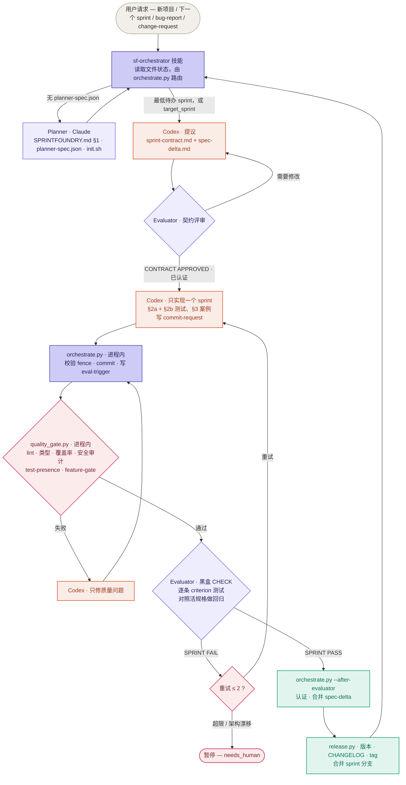

**中文** | [English](./README.md)

# SprintFoundry

SprintFoundry 是一个面向 AI 软件交付的 Claude Code plugin。它封装了一套三代理 sprint harness：Claude 负责规划、路由和独立验收，Codex CLI 负责真实代码实现。

当前版本：[v3.0.0](https://github.com/YuSec2021/sprintfoundry/releases/tag/v3.0.0) · [下载 `sprintfoundry.plugin`](https://github.com/YuSec2021/sprintfoundry/releases/download/v3.0.0/sprintfoundry.plugin)

这个仓库现在主要是 plugin 源码与发布仓库。标准运行入口是 plugin skill：

```text
sf-orchestrator
```

旧的根目录 harness 文件和脚本继续保留，用于开发参考、测试和兼容；正式发布与安装时，应消费 `plugins/sprintfoundry` 下的完整 plugin。

## Plugin 架构

```text
plugins/sprintfoundry/
├── .claude-plugin/
│   └── plugin.json
├── agents/
│   ├── evaluator.md
│   ├── generator.md
│   └── planner.md
└── skills/
    ├── sf-orchestrator/
    │   ├── SKILL.md
    │   ├── scripts/
    │   │   ├── orchestrate.py
    │   │   ├── quality_gate.py
    │   │   └── release.py
    │   └── references/
    │       ├── evaluator-agent.md
    │       ├── generator-rules.md
    │       ├── planner-agent.md
    │       ├── protocol.md
    │       ├── quality-gate.md
    │       └── version-updates.md
    ├── branching/
    │   └── SKILL.md
    └── observability/
        ├── SKILL.md
        └── references/
```

Marketplace 元数据位于：

- `.claude-plugin/marketplace.json`
- `plugins/sprintfoundry/.claude-plugin/plugin.json`

plugin 内包含：

| 组件 | 作用 |
| --- | --- |
| `sf-orchestrator` skill | 面向用户的主协调器和路由引擎 |
| `planner` agent | 把短需求扩展成 `planner-spec.json`、`init.sh` 和 sprint 计划 |
| `generator` agent 文档 | 镜像 Codex Generator 契约，便于人工审阅；真实实现仍由 Codex CLI 执行 |
| `evaluator` agent | 审核 sprint contract，并做独立黑盒验证 |
| `branching` skill | 每个 sprint 一条分支，以及 active branch 恢复 |
| `observability` skill | 运行状态、事件日志、暂停/人工接管摘要、上下文清洁 |

## v3 执行架构

v3 将确定性的机械工作收进脚本边界，让模型只参与真正需要判断的环节。`orchestrate.py` 现在会在进程内串联已验证的 commit request、质量门禁执行与认证、Evaluator 后续路由、spec-delta 合并和发布交接；`quality_gate.py` 负责静态质量检查，`release.py` 负责版本产物、发布 commit 与 tag，以及 sprint 分支合并。

组合入口 `--snapshot`、`--after-contract-review` 和 `--after-evaluator` 取代了重复的状态读取与认证往返。实测完整 happy path 的 Orchestrator 调用从 11 次降至 4 次。通过移除内嵌可执行代码，`sf-orchestrator/SKILL.md` 从 1019 行缩减到 245 行（约 11.8k 降至 2.9k tokens），同时不削弱 contract approval、质量门禁、黑盒 CHECK、attestation 或 fence 闸门。

## 运行模型

SprintFoundry 有严格的职责边界：

| 角色 | 运行时 | 职责 |
| --- | --- | --- |
| Planner | Claude sub-agent | 先判定项目规模，再将需求转成产品方向、验证模式和 sprint 计划 |
| Generator | Codex CLI | 实现一个已批准 sprint，自检，并写入 commit request |
| Evaluator | Claude sub-agent + 验证工具 | 审核 contract，并通过配置的外部表面验证已提交工作 |
| Orchestrator | `sf-orchestrator` skill + 本地脚本 | 读取文件状态，仅在需要判断时调用代理，在进程内完成机械动作，负责 Git commit 和 `.sprintfoundry/signals/eval-trigger.txt`，并在不安全状态下暂停 |

关键边界：

- Claude 不写业务应用代码。
- Codex 不评估自己的输出，也不写 Git 元数据。
- `.sprintfoundry/signals/eval-trigger.txt` 只在 Orchestrator 完成 sprint commit 后写入。
- 进度推进依赖文件产物，而不是聊天记忆。
- Codex 默认运行在仅允许工作区写入的沙箱中，依赖缓存统一放在 `.sprintfoundry/cache/`。
- sprint 只有在 eval result 包含独立的 `SPRINT PASS` 判定行且通过 Orchestrator 签名校验后才算完成。
- `SPRINTFOUNDRY.md` 是项目在架构、测试和案例维度上的顶层宪章，在这些维度上优先于单个 sprint 的决定。

## 主流程

蓝色为 Claude，橙色为 Codex，紫色为 Orchestrator，红色为阻塞式闸门，绿色为 sprint 完成。


```mermaid
flowchart TD
    U(["用户请求 — 新项目 / 下一个 sprint / bug-report / change-request"]) --> O

    O["sf-orchestrator 技能<br/>读取文件状态，由 orchestrate.py 路由"]

    O -->|无 planner-spec.json| PL["Planner · Claude<br/>SPRINTFOUNDRY.md §1 · planner-spec.json · init.sh"]
    PL --> O

    O -->|最低待办 sprint，或 target_sprint| PC["Codex · 提议<br/>sprint-contract.md + spec-delta.md"]
    PC --> CR{"Evaluator · 契约评审"}
    CR -->|需要修改| PC
    CR -->|CONTRACT APPROVED · 已认证| IM

    IM["Codex · 只实现一个 sprint<br/>§2a + §2b 测试、§3 案例<br/>写 commit-request"]
    IM --> CM["orchestrate.py · 进程内<br/>校验 fence · commit · 写 eval-trigger"]
    CM --> QG{"quality_gate.py · 进程内<br/>lint · 类型 · 覆盖率 · 安全审计<br/>test-presence · feature-gate"}
    QG -->|失败| QR["Codex · 只修质量问题"]
    QR --> CM
    QG -->|通过| EV{"Evaluator · 黑盒 CHECK<br/>逐条 criterion 测试<br/>对照活规格做回归"}

    EV -->|SPRINT FAIL| RT{"重试 ≤ 2 ?"}
    RT -->|重试| IM
    RT -->|超限 / 架构漂移| HP(["暂停 — needs_human"])

    EV -->|SPRINT PASS| MG["orchestrate.py --after-evaluator<br/>认证 · 合并 spec-delta"]
    MG --> VB["release.py · 版本 · CHANGELOG · tag<br/>合并 sprint 分支"]
    VB --> O

    classDef claude fill:#EEEDFE,stroke:#7F77DD,stroke-width:1.5px,color:#26215C
    classDef codex fill:#FAECE7,stroke:#D85A30,stroke-width:1.5px,color:#993C1D
    classDef orch fill:#CECBF6,stroke:#534AB7,stroke-width:1.5px,color:#26215C
    classDef gate fill:#FCEBEB,stroke:#D4537E,stroke-width:1.8px,color:#72243E
    classDef good fill:#E1F5EE,stroke:#1D9E75,stroke-width:1.5px,color:#0F6E56
    classDef neutral fill:#F1EFE8,stroke:#B4B2A9,stroke-width:1.4px,color:#2C2C2A

    class U neutral
    class O,CM orch
    class PL,CR,EV claude
    class PC,IM,QR codex
    class QG,RT,HP gate
    class MG,VB good
```

确定性节点会在同一个本地进程中继续执行，直到下一步需要 Planner、Codex、Evaluator 或人工判断。每次转换仍会写入并审计相同的文件状态产物，因此崩溃恢复和信任校验保持显式可查。

## 规划规模

规划前，SprintFoundry 会写入 `.sprintfoundry/state/scope-classification.json`，其中包含
`planning_mode`：

| 模式 | 适用场景 | 初始拆解 |
| --- | --- | --- |
| `standard` | MVP、聚焦工具、单一业务域应用 | 12-20 个 features，8-12 个 sprints |
| `large_system` | 大型管理系统、架构设计文档、RBAC、审批、审计、报表、多租户或多组织范围 | 4-10 个 epics，只展开第一个可执行 epic 为 3-8 个初始 sprints |

这样大型系统不会被压缩成过粗的 12 个 sprint，小型项目也仍然保持轻量。

## 验证模式

Evaluator 不再是浏览器专用验收器。Planner 会在 `planner-spec.json` 中记录外部验证表面：

```json
{
  "verification": {
    "mode": "browser | api | cli | job | library",
    "base_url": "http://localhost:3000",
    "command": "uv run --python <project-python-version> --with pytest pytest -q"
  }
}
```

支持模式：

| 模式 | Evaluator 验证表面 | 典型证据 |
| --- | --- | --- |
| `browser` | Playwright MCP | 截图、可见 UI 状态、用户流程 |
| `api` | `curl`、`httpx`、OpenAPI/Newman 风格检查 | HTTP 状态码、JSON 响应、API 可见持久化状态 |
| `cli` | Shell 命令 | exit code、stdout/stderr、生成文件 |
| `job` | 队列/任务端点或脚本 | 入队任务、轮询状态、副作用 |
| `library` | 外部 consumer 项目或示例脚本 | 安装/导入成功、公开 API 输出 |

因此 SprintFoundry 可以用于前端应用、全栈应用、API 服务、CLI、worker 和 library。

## 项目宪章

目标项目可以通过 `SPRINTFOUNDRY.md` 定义顶层项目宪章：

- §1 固定技术栈、架构边界、允许的依赖、验证表面以及测试/案例/规格目录。
- §2a 要求每条 sprint 验收标准都有一个自动化验收测试。
- §2b 要求独立且长期维护的功能回归测试；数据功能必须覆盖完整 CRUD 矩阵。
- §3 要求每个完成的功能都有可运行的端到端示例。
- §4 定义活规格库及其增量（delta）工作流。

质量门禁中的 `feature-gate` 会确定性检查：修改应用源码的 feature 类型 sprint 必须同时修改声明的功能回归测试目录和案例目录。架构漂移以及测试/案例是否真正覆盖功能，仍由 Evaluator 负责语义判断。

## 活规格库

sprint 合同是一次性的、完成后即归档，因此它们本身无法回答「这个系统**现在**应该表现成什么样」。活规格库就是这个问题的常驻答案，同时充当 Evaluator 的回归基线。

- `specs/<能力域>/spec.md`（路径可通过 `SPRINTFOUNDRY.md` 的 `specs_dir:` 覆盖）存放 `### Requirement:` 块，用 RFC 2119 术语（SHALL / MUST）描述**外部可观测行为**，每条需求配 `#### Scenario:` 的 GIVEN / WHEN / THEN 场景。只写行为，不写内部类名或实现步骤。
- 每个 sprint 产出 `spec-delta.md`，针对**单个能力域**声明 `## ADDED`、`## MODIFIED`、`## REMOVED Requirements`。
- 在通过认证的 `SPRINT PASS` 之后，Orchestrator 确定性地把 delta 合并进该能力域的规格，并归档到 `.sprintfoundry/archive/sprint-{N}/`。
- 需求的身份是**标题**：ADDED 撞名、MODIFIED/REMOVED 找不到目标，都会让 harness 暂停（`spec_delta_conflict`），而不是污染规格。修好 delta 后执行 `orchestrate.py --merge-spec-delta {N}` 恢复。
- CHECK 阶段 Evaluator 会重新验证本 sprint 所触能力域的**既有**场景：满足了自己的合同却打破既有行为 = `SPRINT FAIL`。被本次 delta 标记为 MODIFIED / REMOVED 的需求豁免。

不使用该机制的项目完全不受影响：不写 `spec-delta.md` 时合并步骤是空操作。

## 文件状态协议

SprintFoundry 是文件驱动状态机。Orchestrator 总是优先相信当前文件，而不是历史聊天上下文。

| 文件 | 所有者 | 用途 |
| --- | --- | --- |
| `.sprintfoundry/state/scope-classification.json` | Planner | 规模判定：`standard` 或 `large_system`，包含依据和 epic 轮廓 |
| `SPRINTFOUNDRY.md` | Planner + Human | 项目宪章：架构、双层测试、可运行案例及其目录声明 |
| `planner-spec.json` | Planner | 产品规格、视觉语言、技术栈、验证模式和 sprint 列表 |
| `sprint-contract.md` | Generator + Evaluator | 当前 sprint 的验收合同；未批准前不能编码 |
| `spec-delta.md` | Generator | 本 sprint 针对单个能力域的 ADDED/MODIFIED/REMOVED 需求；PASS 后合并进活规格并归档 |
| `specs/<能力域>/spec.md` | Orchestrator（合并写入） | 活规格库：系统当前应有行为，按能力域组织；Evaluator 的回归基线 |
| `.sprintfoundry/state/sprint-fence.json` | Orchestrator | 实现开始前的预期 sprint 号和 base commit |
| `.sprintfoundry/prompts/sprint-{N}/attempt-{K}-{action}.md` | Orchestrator | 当前 contract、implementation 或 retry 交接的完整 Codex prompt；Codex CLI 命令行只接收读取该文件的短指令 |
| `.sprintfoundry/signals/commit-requests/sprint-{N}.json` | Generator | 请求 Orchestrator 代为提交并创建 trigger |
| `.sprintfoundry/signals/eval-trigger.txt` | Orchestrator | 表示已提交 sprint 等待 quality gate 和评估 |
| `.sprintfoundry/signals/target-sprint.txt` | User + Orchestrator | 可选的 `sprint=N` 指令，用于指定下一个待执行 sprint |
| `.sprintfoundry/results/quality/quality-gate-{N}.md` | Orchestrator | Evaluator CHECK 前的静态质量门禁结果 |
| `.sprintfoundry/results/eval/eval-result-{N}.md` | Evaluator | sprint 结论和证据；只有整行匹配且通过 Orchestrator 签名校验的 `SPRINT PASS` 才代表完成 |
| `~/.sprintfoundry/attest/<project-hash>.json` + `~/.sprintfoundry/attest.key` | Orchestrator | 项目外 HMAC 记录：eval 结论、contract approval、quality gate 和 sprint fence |
| `.sprintfoundry/state/run-state.json` | Orchestrator | 当前模式、重试计数、活跃分支、暂停状态、版本元数据和可选的 `target_sprint` |
| `.sprintfoundry/claude-progress.txt` | Generator + Orchestrator | 简洁滚动交接，不是 transcript |
| `change-request.md` | User + Orchestrator | 分类后的迭代请求：bugfix、minor feature、major feature 或 replan |
| `bug-report.md` | User + Orchestrator | 专用于回归缺陷的输入，进入严格受限的 bugfix sprint |
| `human-escalation.md` | Orchestrator | 当前暂停原因和推荐人工动作 |

运行态文件统一放在 `.sprintfoundry/`。旧版根目录 `run-state.json`、`eval-trigger.txt`、`sprint-fence.json`、`eval-result-*.md` 和 `quality-gate-*.md` 可迁移或兼容读取，但新的机器产物不应再写到项目根目录。

在 v3 中，文件状态仍是权威事实，确定性转换则由进程内连续完成。`orchestrate.py --snapshot` 通过一次调用推导当前路由；`--after-contract-review` 和 `--after-evaluator` 会认证 sub-agent 产物并继续路由，不再消耗单独的模型轮次。报告、认证、归档和审计事件仍会在下一个状态被消费前写入磁盘。

Sprint 进度按集合计算：eval result 必须包含独立的 `SPRINT PASS` 判定行，并与项目外 `~/.sprintfoundry/attest/` 中的 Orchestrator 签名一致。引用文字、未填写的 `SPRINT PASS / SPRINT FAIL` 模板、未签名或签名后被修改的 PASS 文件都不会推进进度。默认路由选择 ID 最小且尚未通过的 sprint；如需乱序执行，可在 `run-state.json` 设置 `target_sprint`，或向 `.sprintfoundry/signals/target-sprint.txt` 写入 `sprint=N`。

Codex 交接现在由本地文件承载：Orchestrator 调用 Codex 前，会先把当前 sprint 的完整指令写入 `.sprintfoundry/prompts/`，命令行只传一个“读取这个本地 prompt 文件”的短包装指令。retry prompt 也会先把 Evaluator 失败详情嵌入该文件，再删除过期的 eval-result，因此重试不依赖已删除状态。

Codex 默认使用 `--sandbox workspace-write --ask-for-approval never`，沙箱内网络默认开放，常见包管理器缓存重定向到 `.sprintfoundry/cache/`。设置 `SPRINTFOUNDRY_CODEX_NETWORK=0` 可关闭网络；只有明确需要完整主机权限时才设置 `SPRINTFOUNDRY_CODEX_SANDBOX=danger`。如果 commit request 修改 harness hooks、核心脚本或 `AGENTS.md`，Orchestrator 会直接拒绝，避免 Generator 改写自身防护规则。

## Quality Gate

Evaluator 做黑盒验证前，Orchestrator 会先运行 `references/quality-gate.md` 中定义的内部质量门禁。

根据检测到的技术栈，它可以运行：

- lint 检查（JS/TS 用 ESLint，Python 用 flake8）
- 类型检查（`tsc --noEmit`、mypy）
- 单元测试
- 覆盖率阈值
- 依赖安全审计（`npm audit`、`pip-audit`）
- 前端静态资源检查：按**文件存在性**触发（而非技术栈关键词），因此不带框架的纯静态站点也能覆盖——HTML 用 htmlhint，CSS 用 stylelint，原生 JavaScript 在框架分支未跑过 ESLint 时补跑 ESLint
- 通过 `jscpd` 生成 diff-aware 重复代码证据：只报告与本 sprint 修改行相交的 clone，并支持可配置的 `warn`、`fail`、`off` 模式
- 与技术栈无关的 `test-presence` 检查：应用源码有改动但没有新增或更新测试文件时直接失败
- `feature-gate` 检查：feature 类型 sprint 必须提供功能回归测试和可运行案例

Quality Gate 失败使用独立的 `quality_retry_count`，不消耗 Evaluator 的 retry 预算。Evaluator 会读取 `.sprintfoundry/results/quality/quality-gate-{N}.md`，并将其纳入 Craft 评分。旧版根目录 `quality-gate-{N}.md` 仅迁移兼容读取，新文件统一写入 `.sprintfoundry/results/quality/`。

Evaluator 还会按固定顺序执行强制复用审查：仓库已有实现、标准库、平台/数据库原生能力、已安装依赖，最后才是最小新增代码。重复候选只是待调查证据，不会自动判失败；如果确认存在无兼容性、安全、性能、许可、包体积或平台约束支撑的实质性重复实现，则 sprint 失败，轻微或有争议的问题只影响 Craft。Originality 只评价产品和领域决策，不奖励重复造轮子。

每条 contract success criterion 还必须包含 `Automated test:` 映射，明确测试文件和执行命令。Evaluator 在功能验收前逐条执行这些命令；缺少映射、测试文件不存在或命令失败，都会直接判定该 sprint 失败。

Orchestrator 会在项目根目录之外为 contract approval、quality-gate 报告、eval 结论和 sprint fence 建立 attestation。签名缺失或文件被修改时，harness 会暂停或重新路由，避免 Generator 自行批准范围、伪造质量报告或自证 sprint 通过。

## 版本策略

每个 sprint 获得 `SPRINT PASS` 后，SprintFoundry 可以自动执行语义化版本 bump：

- `bugfix` -> patch
- 普通 feature / minor feature -> minor
- major feature / replan / 明确的 breaking-change 信号 -> major

版本策略定义在 `references/version-updates.md` 中。通过认证的 `SPRINT PASS` 出现后，`release.py` 会写入 `VERSION`、`CHANGELOG.md` 和 Git tag，再把 sprint 分支合并回基础分支。

## 发布

完整 plugin 源码提交在 `plugins/sprintfoundry` 下。

最新打包版本是 [SprintFoundry v3.0.0](https://github.com/YuSec2021/sprintfoundry/releases/tag/v3.0.0)。可从 GitHub Releases 下载已就绪的 [`sprintfoundry.plugin`](https://github.com/YuSec2021/sprintfoundry/releases/download/v3.0.0/sprintfoundry.plugin) 安装包。

构建可分发 plugin 包：

```bash
bash scripts/package_plugin.sh
```

也可以先 bump plugin 版本：

```bash
bash scripts/package_plugin.sh --bump patch
bash scripts/package_plugin.sh --bump minor
bash scripts/package_plugin.sh --bump major
```

脚本会校验 plugin 结构，同步 plugin manifest 和 marketplace 版本，并写出 `sprintfoundry.plugin`。该归档是本地构建产物，已被 Git 忽略；发布时应通过 release artifact 分发，而不是提交到仓库。

CI 工作流 `.github/workflows/validate-plugins.yml` 会校验：

- marketplace 元数据
- plugin 结构
- 每个 skill 都有 `SKILL.md`
- agents 目录包含 Markdown 定义
- marketplace manifest 与 plugin manifest 版本一致

## 仓库结构

```text
.
├── .claude-plugin/
│   └── marketplace.json
├── .github/
│   └── workflows/
│       └── validate-plugins.yml
├── plugins/
│   └── sprintfoundry/
├── scripts/
│   ├── package_plugin.sh
│   ├── orchestrate.py
│   ├── quality_gate.py
│   ├── release.py
│   ├── run-codex.sh
│   ├── harness-log.py
│   ├── check-agent-sync.sh
│   ├── run-python-tests.sh
│   └── install-hooks.sh
├── examples/
│   ├── bug-report.md
│   ├── change-request.md
│   ├── human-escalation.md
│   ├── planner-spec.json
│   └── scope-classification.json
├── tests/
│   └── test_orchestrate.py
├── SPRINTFOUNDRY.md
├── AGENTS.md
├── CLAUDE.md
├── README.md
└── README.zh-CN.md
```

`scripts/orchestrate.py` 仍然是有用的参考实现和协议测试目标，但可发布产品是完整 Claude Code plugin。

## 开发检查

```bash
# 验证 Python 协议测试
bash scripts/run-python-tests.sh

# 校验并构建 plugin 产物
bash scripts/package_plugin.sh

# 查看生成的归档内容
zipinfo -1 sprintfoundry.plugin
```

`sprintfoundry.plugin`、`*.skill`、`.DS_Store`、运行态状态文件和临时打包目录均被 Git 忽略。

## 在目标项目中使用

安装 plugin 后，当你需要以下能力时，在 Claude Code 中调用 `sf-orchestrator`：

- 启动新的 AI 驱动项目
- 继续下一个 sprint
- 恢复中断的 sprint loop
- 处理 bug report
- 处理 change request
- 检查或恢复已暂停的无人值守状态

该 skill 会读取当前 artifacts，选择下一步路由，并调用对应的 Planner、Codex Generator 或 Evaluator 路径。

SprintFoundry 会在启动时解析明确的 `SPRINTFOUNDRY_PROJECT_ROOT`，所有
Bash、Codex、Planner、Evaluator 工作都从这个项目根目录执行。plugin cache
目录永远不会被当成项目目录，因此多个项目可以同时运行该 plugin，而不会共享
harness 状态。
